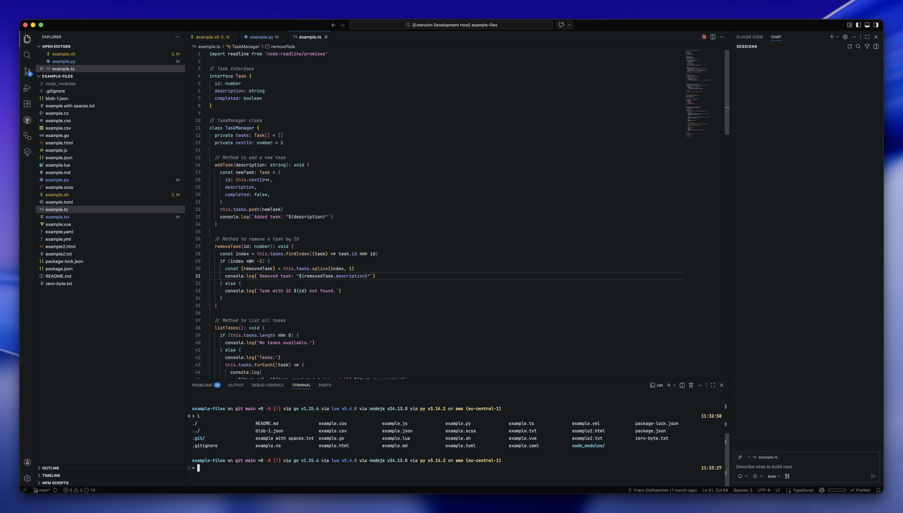
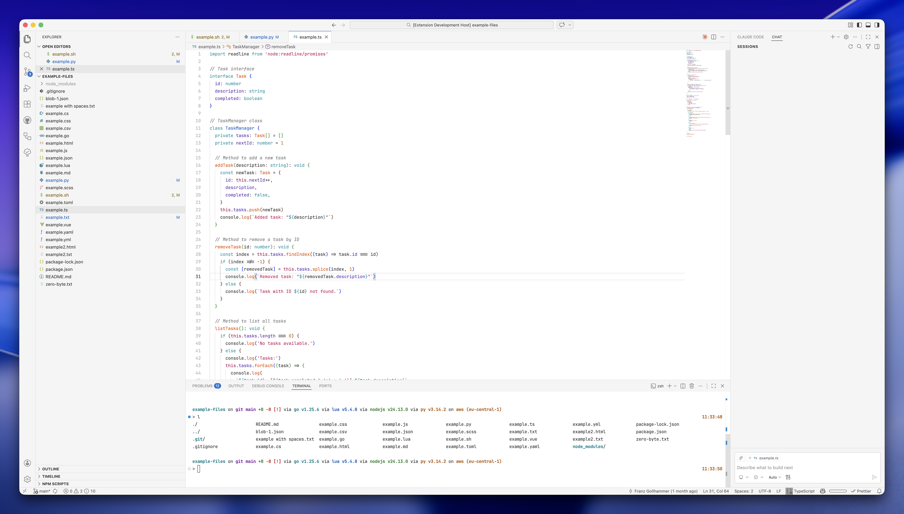

# VS Code Fleet Themes

A collection of elegant, carefully crafted VS Code themes inspired by JetBrains Fleet. Includes both dark and light variants for developers who appreciate clean aesthetics and excellent readability.




## ✨ Features

- **7 Beautiful Variants**: 6 dark themes + 1 light theme
- **Optimized for Readability**: Carefully selected color palettes for reduced eye strain
- **Comprehensive Coverage**: Syntax highlighting for all major languages and frameworks
- **Semantic Highlighting**: Enhanced token colorization for modern languages
- **Polished UI**: Themed editor, terminal, and UI components

## 📦 Installation

### From VS Code Marketplace

1. Open VS Code
2. Go to Extensions (`Ctrl+Shift+X` / `Cmd+Shift+X`)
3. Search for "VS Code Fleet"
4. Click Install

### From Marketplace Link

[Install from Visual Studio Marketplace](https://marketplace.visualstudio.com/items?itemName=franzgollhammer.jb-fleet-dark)

## 🎨 Activate a Theme

1. Open Command Palette (`Ctrl+Shift+P` / `Cmd+Shift+P`)
2. Type "Preferences: Color Theme"
3. Choose one of the available variants:
   - **Fleet** - The classic Fleet experience
   - **Fleet Dark** - Deeper, darker variant
   - **Fleet Grey** - Elegant grey tones
   - **Fleet Ocean** - Cool ocean-inspired blues
   - **Fleet Palenight** - Soft purple night theme
   - **Sphere** - Alternative modern variant
   - **Fleet Light** - Clean, bright light theme

## ⚙️ Recommended Settings

For the best experience, add these settings to your `settings.json`:

```json
{
	"workbench.colorTheme": "Fleet",
	"editor.fontFamily": "JetBrainsMono Nerd Font",
	"editor.lineHeight": 1.7,
	"debug.console.lineHeight": 1.3,
	"terminal.integrated.lineHeight": 1.3,
	"editor.smoothScrolling": true,
	"editor.fontLigatures": true,
	"editor.cursorSmoothCaretAnimation": "on"
}
```

## 🔤 Recommended Font

For optimal appearance with programming ligatures and symbols:

**JetBrains Mono Nerd Font**

1. Download from [Nerd Fonts](https://www.nerdfonts.com/font-downloads) (select JetBrainsMono)
2. Install the font on your system
3. Configure VS Code to use it (see Recommended Settings above)

### Why JetBrains Mono?

- Designed specifically for developers
- Excellent ligature support
- Clear distinction between similar characters (0/O, 1/l/I)
- Nerd Font variant includes icons and symbols

## 🔧 Compatibility

- **VS Code**: Version 1.82.0 or higher
- **Platforms**: Windows, macOS, Linux
- **Languages**: Supports all major programming languages

## 📝 Changelog & License

- **Changelog**: [CHANGELOG.md](./CHANGELOG.md)
- **License**: MIT - [License.md](./License.md)

## 🙏 Acknowledgements

This theme is inspired by the beautiful design of [JetBrains Fleet](https://www.jetbrains.com/fleet/).

## 🐛 Issues & Contributions

Found a bug or have a suggestion? Please open an issue on [GitHub](https://github.com/franzgollhammer/jb-fleet-dark).

---

**Enjoy coding with Fleet!** ⚡
