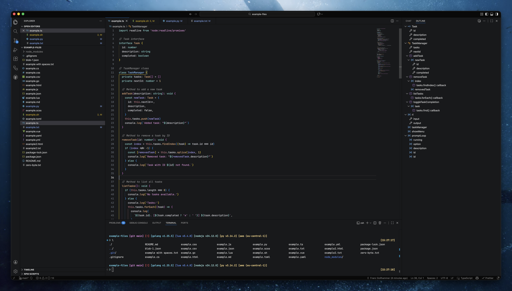

# VS Code Fleet Themes

VS Code themes inspired by JetBrains Fleet Dark, with multiple variants.



## Installation

- Marketplace: https://marketplace.visualstudio.com/items?itemName=franzgollhammer.jb-fleet-dark
- From VS Code: Open Extensions, search for "VS Code Fleet", then Install.

## Activate a Theme

Open Command Palette → "Preferences: Color Theme" → choose one of:

- Fleet
- Fleet Dark
- Fleet Grey
- Fleet Ocean
- Fleet Palenight
- Sphere

## Recommended Settings (settings.json)

```json
{
	"workbench.colorTheme": "Fleet",
	"editor.fontFamily": "JetBrainsMono Nerd Font",
	"editor.fontSize": 13,
	"terminal.integrated.fontSize": 13,
	"editor.lineHeight": 1.7,
	"debug.console.lineHeight": 1.3,
	"terminal.integrated.lineHeight": 1.3,
	"editor.smoothScrolling": true,
	"editor.fontLigatures": true,
	"editor.cursorSmoothCaretAnimation": "on"
}
```

## Font

Install JetBrains Mono Nerd Font so ligatures and symbols render nicely:

- Download: https://www.nerdfonts.com/font-downloads (choose JetBrainsMono)
- After installing, set `editor.fontFamily` as in the settings above.

## Compatibility

Requires VS Code 1.82+.

## Changelog & License

- Changelog: [CHANGELOG.md](./CHANGELOG.md)
- License: [License.md](./License.md)

## Acknowledgements

Inspired by JetBrains Fleet.
